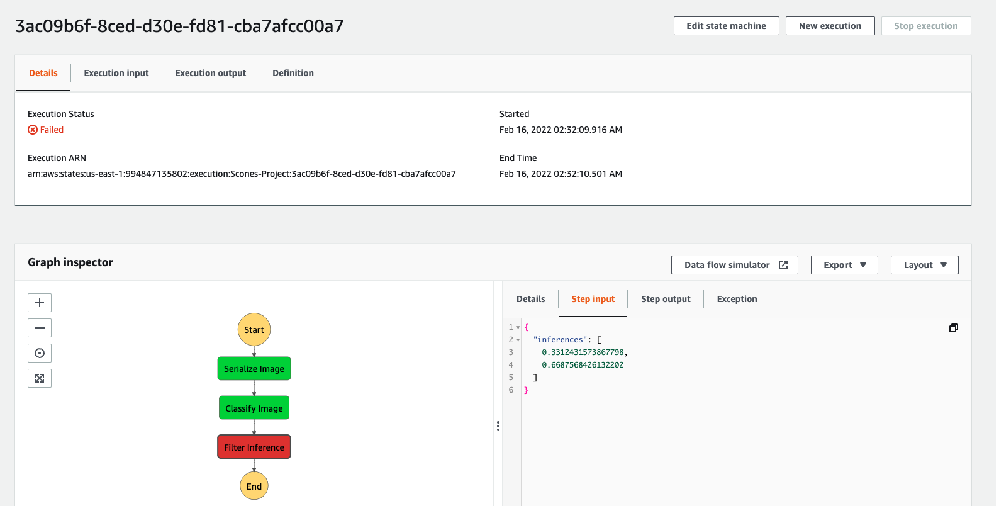

## ML Inference Pipeline in AWS

Step Function Setup

Su

### Acknowledgements

The CIFAR dataaset is open source and generously hosted by the University of Toronto at: https://www.cs.toronto.edu/~kriz/cifar-100-python.tar.gz

